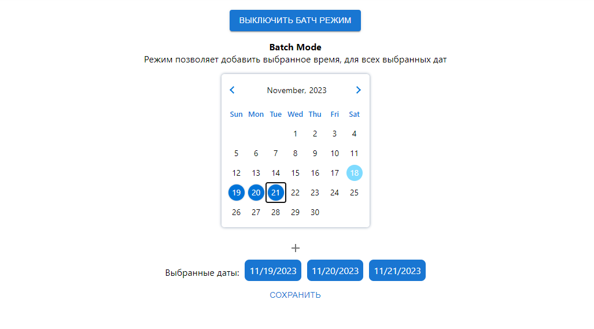
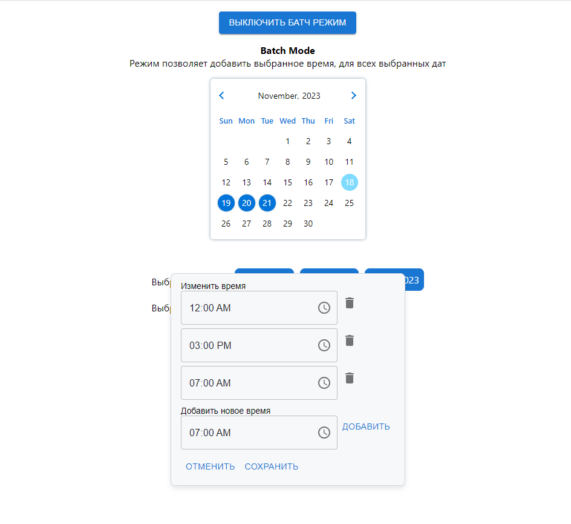
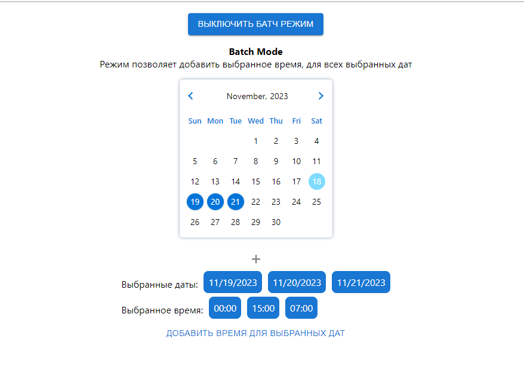
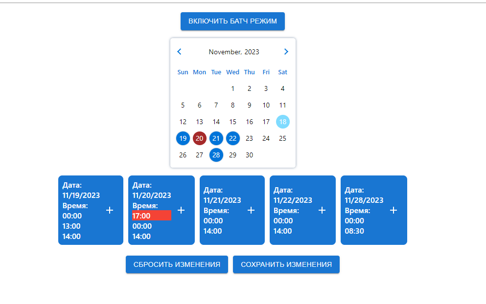

# Редактировать адрес

Вводишь новый адрес, затем нажимаешь кнопку сохранить

Для того, чтобы между текстом был перенос строки, используй `\n` оператор

# Редактировать услуги

Позволяет изменять / удалять / добавлять услуги

```bash
id услуги это уникальный набор символов на английском языке
```

# Неподтвержденные записи

Список запросов на запись, которые запросили клиенты, но ты их ещё не подтвердила

# Подтвержденные записи

Список записей, которые ты подтвердила, с информацией о клиенте, датой и т.д.

`Можно отменить запись, кликнув по кнопке рядом`

# Свободные даты

Список дат, которые ты добавила, но на них еще нет записей

# Добавление новых дат

`!!! Не забудь, что время должно быть кратно 30 минутам (к примеру 17:00, 17:30)`

`!!! Красным помечены даты, на которые уже есть запись! Их нельзя редактировать`

`!!! Синим обозначены свободные даты`

С помощью календаря можно добавить новые даты,
затем внизу появится список добавленных дат, где можно добавить / удалить / изменить время для конкретной даты

Кнопка `Сбросить изменения`, вернет записи к исходному состоянию до редактирования
Кнопка `Сохранить изменения`, сохранит изменения в базе данных, после чего они обновяться в боте

# Batch режим

Режим позволяет добавить выбранное время, для всех выбранных дат в этом режиме

1. Выбери даты, для которых хочешь добавить время
   

2. Кликнув на `+`, в открывшемся окне, выбери время, которое хочешь добавить, затем нажми сохранить, чтобы окно закрылось.
   

3. После того как выбрали даты и время, нажимаем на кнопку `Добавить время для выбранных дат`
   

4. Дальше нас перебросит на обычный режим, где мы можем продолжить редактировать / сохранять даты
   
